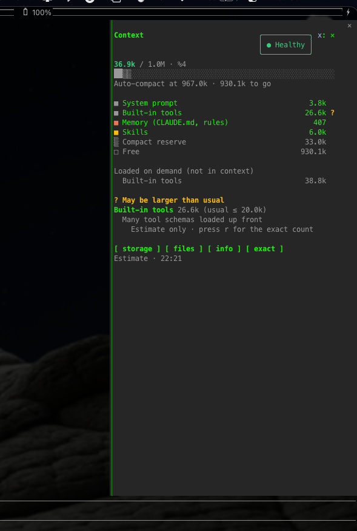

# cc-side-context

**See what is eating your Claude Code context, and fix it in one key.**

A live side pane for [Claude Code](https://claude.com/claude-code). It shows which tool outputs are filling your context window, when your prompt cache goes cold, and when a long conversation has started to lose track. When it is time to act, one key compacts while keeping your decisions, or writes a handoff note for a fresh session.



## Why

- `/context` tells you that *Conversation* is 320k tokens. It does not tell you that 60k of that is one `package-lock.json` you read three times.
- Compaction is lossy. The rules you gave early on, the files you changed and the approaches you rejected are often the first things the summary drops.
- On a 1M window, every message re-sends the whole conversation. Past a few hundred thousand tokens, each message costs a lot of your usage, and answers get worse well before auto-compact starts.
- The prompt cache expires after 5 minutes on an API key (1 hour on a subscription). After a coffee break, your next message pays to write the whole conversation into the cache again, and nothing tells you.

## What it shows

```
● Healthy  56.3k / 1.0M                        +4.7k
███▒▒░░░░░░░░░░░░░░░░░░░░░░░░░░░░░░░░░░░░░░░░░░░░░░░
▂▂▃▅  193.7k to quality limit
cache 59m · 5h 49% · 7d 68% · $1.24

■ System prompt                                 4.7k
■ Built-in tools                               27.6k
■ Skills                                        6.0k
■ Conversation                                 16.3k

Top context eaters
  Read package-lock.json ×3                   ~61.2k
  github › get_issue                          ~11.4k
  ↳ Read a range (offset/limit), not the whole file

[ compact ] [ handoff ] [ more ]
Estimate · 23:39
```

| | |
| --- | --- |
| **Top context eaters** | The tool results still in your conversation, biggest first. Repeated reads of the same target are merged into one row. The biggest one comes with a tip on how to keep it smaller next time. |
| **Per-category breakdown** | System prompt, tools, MCP, memory files, skills and conversation, live after every turn. Free space and the compact reserve are the pale end of the bar. A row that is larger than usual is flagged, with a one-line fix under it. |
| **Room left** | How far it is to the quality limit (or to auto-compact), with a trend of the context after each turn. A drop is a compaction. |
| **Prompt cache** | `cache 58m` counts down from the last reply. When the cache goes cold you get one warning, before your next message pays to write the whole conversation into it again. |
| **Limits and cost** | 5h and 7d usage on a subscription, and session cost on an API key. |
| **Quality limit** | On large windows the pane warns at 250k tokens (configurable), long before auto-compact would start. |
| **Grid view** | The same grid and category list that `/context` draws (⛁ ⛀ ⛶ ⛝). |

## What it does

| Key | Command | Effect |
| --- | --- | --- |
| `c` | `/side-context compact` | **Compaction with a keep-list.** Tells the summary to keep your goal and rules word for word, every file changed, decisions and rejected approaches, open tasks and the next step. The same keep-list is also added to auto-compaction and to your own `/compact`. The pane shows `◌ Compacting` while the summary is written. |
| `w` | `/side-context handoff` | **Handoff note.** Writes `.claude/side-context/handoff.md` (goal, recent requests, open todos, files changed and read, where it stopped) from the transcript, at no token cost, and copies the line to start a fresh session with. |
| `s` | | Switch between the list and the `/context` grid (under **more**). |
| `e` | | Show the largest memory files, loaded MCP tools, skills, and the tools loaded on demand. |
| `r` | `/side-context full` | Recount exactly with the token-count API, as `/context` does (under **more**, or when a row is flagged). |
| | `/side-context` · `on` · `off` | Toggle, show or hide the pane. |

## Install

```text
/plugin marketplace add bcanozgur/cc-side-context
/plugin install cc-side-context@cc-side-context
```

Restart Claude Code. The pane opens with every new session when the terminal is at least 144 columns wide. In a narrower terminal, open it with `/side-context`.

To update after a new release: `/plugin` → cc-side-context → update, then restart.

> **Requirements:** Claude Code 2.1.29x or newer, with function hooks (plugin `hooks/register.tsx` modules). That API is in early access and may change between releases.

### Works with claude-hud

[claude-hud](https://github.com/jarrodwatts/claude-hud) keeps a one-line status under your input. This pane shows *why* the number is what it is, and what to do about it. Use both.

| | `/context` | status line HUDs | **cc-side-context** |
| --- | :-: | :-: | :-: |
| Total and per-category usage | ✓ (on demand) | total | ✓ live |
| Which tool results fill the window | | | ✓ |
| Prompt cache countdown and cold warning | | ✓ | ✓ |
| Compaction that keeps decisions and files | | | ✓ |
| Handoff note for a fresh session | | | ✓ |
| Quality budget below auto-compact | | | ✓ |

## Settings

Set in `/config` → plugin options, or with `claude plugin configure cc-side-context`.

| Option | Default | |
| --- | --- | --- |
| `qualityBudget` | `250000` | Warn and suggest compacting past this many tokens, when that is before auto-compact. `0` turns it off. |
| `smartCompact` | `true` | Add the keep-list to every compaction. |
| `cacheTtl` | `auto` | Cache lifetime for the countdown: `auto` (1h on a subscription, 5m on an API key), `5m` or `1h`. |

## How the numbers are made

- **Estimate vs. exact.** After each turn, the breakdown refreshes from a free local estimate. An estimate can only raise a question (`?`). Only an exact count (`r`, or the storage view) flags a row as too large (`*`). Exact counts send token-count requests, as `/context` does.
- **After `/clear` or `/resume`** the pane measures the new conversation at once. The cache countdown starts again at its first reply.
- **Top eaters** are sized from each tool result's text (about 4 characters a token), so they read `~`. Results that compaction has already summarized drop off the list.
- **Cache countdown** starts at the last main-thread response. The 5m/1h guess can be wrong for your setup: set `cacheTtl` if it is.
- **Privacy.** Nothing leaves your machine apart from the exact counts. The handoff note is the only file the plugin writes.

## Develop

```text
hooks/register.tsx   the hooks module: commands, refresh, compaction, pane drawing
hooks/analysis.ts    transcript analysis: eaters, keep-list, handoff
types/index.d.ts     state contract and snapshot types
tests/               claude plugin test suite
```

```bash
claude plugin validate .
claude plugin test .
claude --plugin-dir .   # load the working copy into a session
```

## License

[MIT](LICENSE)
